<div align="center">

# 🌍 TerraPulse

### AI-powered ground deformation & subsidence intelligence for QGIS

*Draw an AOI · Pick a date range · Get a deformation map*  
*No SAR expertise required.*

<br/>

[](https://github.com/Osman-Geomatics93/TerraPulse-Plugin/actions/workflows/ci.yml)
[](https://github.com/Osman-Geomatics93/TerraPulse-Plugin/releases)
[](https://plugins.qgis.org/plugins/terrapulse/)
[](https://hub.docker.com/r/osmanos93/terrapulse-pygmtsar)
[](plugin/terrapulse/LICENSE)
[](packages/terrapulse_core/tests)
[](https://python.org)
[](https://qgis.org)
[](https://github.com/Osman-Geomatics93/TerraPulse-Plugin/commits/main)
[](https://github.com/Osman-Geomatics93/TerraPulse-Plugin/issues)
[](https://github.com/Osman-Geomatics93/TerraPulse-Plugin/stargazers)

<br/>

[**📦 Install Plugin**](#-installation) · [**🐳 Docker Image**](#-docker-engine) · [**🚀 Quick Start**](#-first-run-walkthrough) · [**📖 Science**](#-how-it-works) · [**🤝 Contribute**](#-contributing) · [**💬 Discuss**](https://github.com/Osman-Geomatics93/TerraPulse-Plugin/discussions)

</div>

---

## 🎬 Demo

> **📸 Screenshot preview** — draw your AOI, run the analysis, get your deformation map.

<div align="center">

| Draw AOI | Processing | Velocity Map | Risk Report |
|:---:|:---:|:---:|:---:|
| 🗺️ Rubber-band polygon on the QGIS canvas | ⚙️ SBAS-InSAR pipeline in Docker | 🟥🟨🟩 Velocity COG layer styled in QGIS | 📄 HTML + PDF with AI narrative |

*A full demo GIF is coming in v0.3.0. [Watch for updates →](https://github.com/Osman-Geomatics93/TerraPulse-Plugin/releases)*

</div>

---

## ✨ What TerraPulse Does

TerraPulse turns **free Sentinel-1 SAR time-series** into actionable ground deformation intelligence — directly inside QGIS, with zero satellite imagery expertise required.

<table>
<tr>
<td width="50%">

**🗺️ Draw your Area of Interest**
Use the built-in rubber-band polygon tool or import any vector layer as your AOI.

**🛰️ Automatic STAC Discovery**
Queries the Copernicus Data Space Ecosystem catalog and builds an optimal Sentinel-1 SLC stack for your time window.

**⚙️ SBAS-InSAR Processing**
Full Small Baseline Subset pipeline via PyGMTSAR inside a local Docker container — no cloud subscription needed.

</td>
<td width="50%">

**🤖 ML Deformation Classification**
Random Forest classifier labels every pixel: Stable / Linear / Seasonal / Accelerating / Anomalous.

**⚠️ Infrastructure Risk Overlay**
Cross-references OSM buildings, roads, pipelines and critical nodes with deformation rates to produce a composite risk score.

**📄 AI-Written Reports**
HTML + PDF reports with plain-language narratives powered by Anthropic Claude, plus a YAML provenance recipe and STAC 1.0 item.

</td>
</tr>
</table>

---

## 🔬 How It Works

TerraPulse implements the **Small Baseline Subset (SBAS) InSAR** technique:

```
Sentinel-1 SLC images
        │
        ▼
  Coregistration          ← All scenes aligned to a common reference
        │
        ▼
  Interferogram stack     ← Phase difference between image pairs (range of baselines)
        │
        ▼
  Phase unwrapping        ← SNAPHU converts wrapped [-π,π] phase to continuous signal
        │
        ▼
  SBAS inversion          ← Least-squares inversion → surface velocity (mm/yr)
        │
        ▼
  COG output              ← Cloud-Optimised GeoTIFF, directly loadable in QGIS
```

SBAS uses **multiple small-baseline interferometric pairs** to maximise temporal coverage and minimise decorrelation — making it robust even over vegetated or urban areas. The result is a **line-of-sight velocity map** in mm/year: negative = subsidence (moving away from satellite), positive = uplift.

> 📚 Reference: [Berardino et al. 2002, IEEE TGRS](https://doi.org/10.1109/TGRS.2002.803792) · [PyGMTSAR documentation](https://github.com/mobigroup/PyGMTSAR)

---

## 🔄 Processing Pipeline

```mermaid
flowchart LR
    A["🗺️ Draw AOI\n(QGIS canvas)"] --> B["🛰️ STAC Discovery\n(Copernicus catalog)"]
    B --> C["⬇️ Download SLC\n(parallel HTTP Range)"]
    C --> D["📐 Coregistration\n(PyGMTSAR)"]
    D --> E["🌀 Interferograms\n(SBAS pairs)"]
    E --> F["🔓 Unwrapping\n(SNAPHU)"]
    F --> G["📊 SBAS Inversion\n(velocity mm/yr)"]
    G --> H["🤖 ML Classify\n(5 classes)"]
    H --> I["⚠️ Risk Overlay\n(OSM assets)"]
    I --> J["📄 Report\n(HTML + PDF)"]

    style A fill:#4CAF50,color:#fff
    style J fill:#2196F3,color:#fff
```



**IPC protocol:** The QGIS plugin communicates with the Docker engine via JSON over stdin/stdout — progress messages are throttled to 1 per 1% to prevent pipe buffer saturation on large (8 GB) SLC scenes.

---

## 🌍 Use Cases

<table>
<tr>
<th>Domain</th>
<th>Application</th>
<th>What TerraPulse measures</th>
</tr>
<tr>
<td>🏙️ <b>Urban planning</b></td>
<td>City-wide subsidence monitoring</td>
<td>Building-by-building sinking rates over 1–3 years</td>
</tr>
<tr>
<td>🏗️ <b>Infrastructure</b></td>
<td>Bridge, road & pipeline integrity</td>
<td>Differential deformation along linear assets</td>
</tr>
<tr>
<td>💧 <b>Groundwater</b></td>
<td>Aquifer depletion mapping</td>
<td>Seasonal vs long-term compaction signals</td>
</tr>
<tr>
<td>⛏️ <b>Mining</b></td>
<td>Open-pit and underground subsidence</td>
<td>Surface deformation above extraction zones</td>
</tr>
<tr>
<td>🌋 <b>Geohazard</b></td>
<td>Landslide & volcanic deformation</td>
<td>Pre-failure accelerating displacement anomalies</td>
</tr>
<tr>
<td>🏚️ <b>Disaster response</b></td>
<td>Post-earthquake damage assessment</td>
<td>Co-seismic ground displacement maps</td>
</tr>
<tr>
<td>🌾 <b>Agriculture</b></td>
<td>Irrigation-induced subsidence</td>
<td>Seasonal soil compaction in irrigated fields</td>
</tr>
<tr>
<td>🌊 <b>Coastal zones</b></td>
<td>Sea-level rise compound risk</td>
<td>Land subsidence + tidal flooding vulnerability</td>
</tr>
</table>

---

## ⚡ Performance

| Mode | Typical Time | Scenes | Resolution | Best For |
|------|-------------|--------|-----------|----------|
| 🟢 **Quick** | ~30 min | up to 10 | Coarse | Rapid assessment, preview |
| 🟡 **Standard** | ~2 hours | up to 24 | Medium | Default — balanced quality |
| 🔴 **High Precision** | ~6 hours | up to 60 | Maximum | Final analysis, reporting |

> **4× faster downloads** via parallel HTTP Range requests — an 8 GB SLC scene downloads in minutes, not hours.  
> **Pipe-safe IPC** — progress messages throttled to prevent Docker stdout deadlock on large downloads.

---

## 📦 Installation

> 🐳 **Heads up:** TerraPulse needs Docker Desktop running with the engine image. The plugin auto-pulls it on first use, but pre-pulling saves 5 minutes on your first run:
> ```bash
> docker pull osmanos93/terrapulse-pygmtsar:latest
> ```
> [More on the Docker engine ↓](#-docker-engine)

### Option 1 — QGIS Plugin Repository *(recommended)*

```
QGIS → Plugins → Manage and Install Plugins → Search "TerraPulse" → Install
```

### Option 2 — Install from ZIP

[](https://github.com/Osman-Geomatics93/TerraPulse-Plugin/releases/latest)

In QGIS: **Plugins → Manage and Install Plugins → Install from ZIP**

### Option 3 — Development install (symlink)

```bash
git clone https://github.com/Osman-Geomatics93/TerraPulse-Plugin.git
cd TerraPulse-Plugin
```

**Windows (PowerShell as Admin):**
```powershell
$PluginDir = "$env:APPDATA\QGIS\QGIS3\profiles\default\python\plugins"
New-Item -ItemType SymbolicLink -Path "$PluginDir\terrapulse" `
         -Target (Resolve-Path plugin\terrapulse)
```

**Linux / macOS:**
```bash
ln -s $(pwd)/plugin/terrapulse \
      ~/.local/share/QGIS/QGIS3/profiles/default/python/plugins/terrapulse
```

### Prerequisites

| Requirement | Version | Notes |
|-------------|---------|-------|
| QGIS | ≥ 3.34 LTR | [Download](https://qgis.org/download/) |
| Docker Desktop | ≥ 4.x | [Download](https://www.docker.com/products/docker-desktop/) |
| CDSE account | free | [Register](https://dataspace.copernicus.eu/) — Sentinel-1 access |
| Anthropic API key | optional | [Get key](https://console.anthropic.com/) — AI narrative in reports |

---

## 🐳 Docker Engine

The InSAR processing engine runs inside a pre-built Docker image — **no GMTSAR, PyGMTSAR, or SNAPHU installation** required on your machine. The plugin spawns the container for you on every run.

<div align="center">

[](https://hub.docker.com/r/osmanos93/terrapulse-pygmtsar)
[](https://hub.docker.com/r/osmanos93/terrapulse-pygmtsar/tags)
[](https://hub.docker.com/r/osmanos93/terrapulse-pygmtsar)

</div>

### ⚡ One-line install (recommended)

Pre-pull the image **before your first InSAR run** so it's already on disk:

```bash
docker pull osmanos93/terrapulse-pygmtsar:latest
```

> 💡 **You can skip this** — the plugin auto-pulls the image on the first run if it isn't local yet. Pre-pulling just removes the ~5 minute one-time download from your first analysis.

### ✅ Verify the image works

```bash
docker run --rm osmanos93/terrapulse-pygmtsar:latest \
    python -c "import pygmtsar, terrapulse_core; print('✓ Engine ready')"
```

Expected output: `✓ Engine ready`

### 📦 Available tags

| Tag | Recommended for | Notes |
|-----|-----------------|-------|
| **`osmanos93/terrapulse-pygmtsar:latest`** | Most users | Tracks the newest stable engine release |
| `osmanos93/terrapulse-pygmtsar:0.2.1` | Reproducible pipelines | Pinned version — won't change |

<details>
<summary><b>🔧 What's inside the image</b> (click to expand)</summary>

<br/>

| Component | Version | Role |
|-----------|---------|------|
| Ubuntu | 22.04 LTS | Base OS |
| Python | 3.11 | Runtime |
| GMT | 6.3 | Grid mapping toolkit |
| GMTSAR | 6.5 | SAR processing primitives |
| SNAPHU | 2.0.6 | Phase unwrapping |
| PyGMTSAR | 2024.1.21.post4 | Python InSAR wrapper |
| terrapulse_core | matches plugin version | TerraPulse engine logic |
| GDAL | 3.4+ | Raster I/O |

Total image size: **~928 MB compressed**, ~3.8 GB on disk after pull.

</details>

### 🛠️ Useful Docker commands

| Command | What it does |
|---------|--------------|
| `docker pull osmanos93/terrapulse-pygmtsar:latest` | Update to the newest image |
| `docker images osmanos93/terrapulse-pygmtsar` | See which versions are on your machine |
| `docker rmi osmanos93/terrapulse-pygmtsar:latest` | Remove (frees ~3.8 GB) |
| `docker system df` | See total Docker disk usage |

### 🔍 Where it appears in Docker Desktop

After `docker pull`, open Docker Desktop → **Images** → search **terrapulse** → you'll see the image with size, tag, and a Run button. **Don't click Run from Docker Desktop manually** — the plugin spawns the container with the correct volume mounts and IPC flags. Use Docker Desktop only to inspect, update, or delete the image.

> 🔗 **Docker Hub page:** https://hub.docker.com/r/osmanos93/terrapulse-pygmtsar (no login required for pulls)

---

## 🚀 First Run Walkthrough

| Step | Action |
|------|--------|
| **1** | Open QGIS → click the **🌍 TerraPulse** toolbar icon (or Plugins → TerraPulse) |
| **2** | Open **⚙️ Settings** → enter your [free CDSE credentials](https://dataspace.copernicus.eu/) |
| **3** | Click **✏ Draw on Map** → draw a polygon over your study area |
| **4** | Set **Start date** and **End date** (e.g. 2023-01-01 → 2023-12-31) |
| **5** | Click **🔍 Discover Scenes** → preview the Sentinel-1 stack size and coverage |
| **6** | Choose processing mode → click **🚀 Run Analysis** |
| **7** | Watch the progress bar — Docker handles the heavy lifting |
| **8** | Results dialog → **Add to Map** · **Classify** · **Generate Report** |

---

## 🏗️ Architecture

```
┌──────────────────────────── QGIS process ─────────────────────────────────┐
│                                                                            │
│   MainDialog ──► AOIMapTool (rubber-band polygon)                         │
│       │                                                                    │
│       ├──► STACDiscoveryTask (QgsTask) ──► terrapulse_core.stac.client    │
│       │                                                                    │
│       └──► InSARTask (QgsTask) ──► EngineIPCClient                        │
│                                         │                                  │
│                                         │  JSON / stdin ──►               │
│                                         │  ◄── JSON / stdout (progress)   │
│                                         │                                  │
│   ResultsDialog ◄───────────────────────┘                                 │
│       ├──► ClassifyTask ──► terrapulse_core.ml                            │
│       ├──► ReportTask ──► terrapulse_core.{risk, reporting}               │
│       └──► Layer loaders ──► QgsRasterLayer (COG)                         │
│                                                                            │
│   SettingsManager ──► QgsSettings (OS keystore)                           │
└────────────────────────────────────────────────────────────────────────────┘
                              │ docker run -i
          ┌───────────────────▼──────────────────────────────┐
          │           Docker container                        │
          │    engine_server.py                               │
          │      ├── CDSEDownloader (parallel HTTP Range)     │
          │      ├── STACClient → Copernicus STAC API         │
          │      └── PyGMTSAREngine                           │
          │            ├── coregistration                     │
          │            ├── interferogram stack                │
          │            ├── SNAPHU phase unwrapping            │
          │            └── SBAS inversion → velocity COG      │
          └───────────────────────────────────────────────────┘
```

> **Key design principle:** `terrapulse_core` has **zero QGIS dependency**. It runs inside Docker and is fully tested without QGIS. The plugin is a thin Qt layer that only manages UI state and task orchestration.

---

## ⚠️ Known Limitations

| Limitation | Detail | Workaround |
|-----------|--------|------------|
| **Requires Docker** | Local processing needs Docker Desktop running | Cloud mode (OpenEO) planned for v0.4 |
| **Linux/Windows/macOS only** | No mobile or browser support | — |
| **Tropical coherence** | Dense vegetation causes InSAR decorrelation | Use shorter temporal baselines; dry season preferred |
| **Processing time** | Standard mode ≈ 2 hrs on a 4-core machine | Use Quick mode for previews |
| **AOI size** | Very large areas (> ~5,000 km²) may require multiple runs | Tile your AOI and mosaic results |
| **Flat areas** | Near-zero deformation areas may show noise floor | Interpret results with ≥ 5 mm/yr threshold |
| **Internet required** | STAC discovery and SLC download need connectivity | Pre-cache SLC files for offline use |

---

## ❓ FAQ

<details>
<summary><b>Do I need a paid CDSE account?</b></summary>

No. The [Copernicus Data Space Ecosystem](https://dataspace.copernicus.eu/) offers a **free tier** that includes Sentinel-1 SLC access. Register with any email address — no credit card required.

</details>

<details>
<summary><b>Can I run TerraPulse without Docker?</b></summary>

Not yet. Docker isolates the complex GMTSAR/PyGMTSAR/SNAPHU environment so you don't need to install them manually. A **cloud processing mode** using OpenEO is planned for v0.4.0 and will require no local Docker installation.

</details>

<details>
<summary><b>How much disk space do I need?</b></summary>

Each Sentinel-1 SLC scene is approximately 4–9 GB. A Standard mode run (24 scenes) may use **100–200 GB** of temporary space. TerraPulse caches downloaded scenes so repeated runs over the same area are much faster.

</details>

<details>
<summary><b>Why is my plugin version blocked on the QGIS repository?</b></summary>

The QGIS Plugin Repository runs `detect-secrets` on every upload. Variable names like `cdse_password` (a QgsSettings key name — not an actual credential) can be flagged as false positives. The fix is to add `# pragma: allowlist secret` to the affected lines. TerraPulse ≥ 0.2.3 includes these suppressions and passes cleanly.

</details>

<details>
<summary><b>What coordinate reference systems are supported?</b></summary>

You can draw your AOI in **any CRS** — TerraPulse reprojects it to WGS-84 internally before querying the STAC catalog. Output COGs are delivered in WGS-84 / UTM and can be reprojected in QGIS.

</details>

<details>
<summary><b>Can I use my own Sentinel-1 data instead of downloading from CDSE?</b></summary>

Yes. Place your `.SAFE` directories in the `<output_dir>/.cache/slc/` folder before starting a run. TerraPulse detects cached scenes and skips the download step automatically.

</details>

<details>
<summary><b>Is the Anthropic API key required?</b></summary>

No. The AI narrative in reports is **optional**. Without an API key, TerraPulse generates a complete report using a templated fallback — all charts, maps, and tables are included; only the plain-language paragraph summary is omitted.

</details>

---

## 🔬 Technology Stack

<table>
<tr><th>Layer</th><th>Technology</th><th>Version</th></tr>
<tr><td>🛰️ InSAR engine (local)</td><td>PyGMTSAR + GMTSAR + SNAPHU</td><td>2024.1.21+</td></tr>
<tr><td>☁️ InSAR engine (cloud)</td><td>OpenEO via CDSE</td><td>≥ 0.31</td></tr>
<tr><td>🗂️ STAC catalog</td><td>pystac-client + pystac</td><td>≥ 0.8</td></tr>
<tr><td>🗺️ Raster I/O</td><td>rasterio + odc-stac + xarray + zarr</td><td>≥ 1.3</td></tr>
<tr><td>🤖 ML classification</td><td>scikit-learn (Random Forest)</td><td>≥ 1.5</td></tr>
<tr><td>🌍 Risk analysis</td><td>overpy + GeoPandas + shapely</td><td>≥ 0.7 / ≥ 1.0</td></tr>
<tr><td>📄 Reporting</td><td>Jinja2 + WeasyPrint + Plotly</td><td>≥ 3.1 / ≥ 62</td></tr>
<tr><td>🧠 LLM narrative</td><td>Anthropic SDK (Claude)</td><td>≥ 0.28</td></tr>
<tr><td>🔌 Plugin CI</td><td>qgis-plugin-ci</td><td>latest</td></tr>
<tr><td>🔒 Security scanning</td><td>bandit + detect-secrets + flake8</td><td>latest</td></tr>
</table>

---

## 🗂️ Repository Structure

```
TerraPulse-Plugin/
│
├── 📦 packages/terrapulse_core/       Pure Python engine — zero QGIS dependency
│   └── src/terrapulse_core/
│       ├── stac/                      Sentinel-1 STAC discovery + models
│       ├── insar/                     PyGMTSAR / OpenEO engine wrappers
│       ├── io/                        COG writer · Docker IPC client
│       ├── ml/                        Feature extraction · RF classifier
│       ├── risk/                      OSM querier · asset risk ranker
│       ├── reporting/                 Jinja2/WeasyPrint renderer · LLM client
│       └── provenance/                YAML recipe · STAC 1.0 item writer
│
├── 🔌 plugin/terrapulse/              QGIS plugin (thin PyQt5 wrapper)
│   ├── dialogs/                       Main · Settings · Results dialogs
│   ├── tasks/                         QgsTask: STAC · InSAR · Classify · Report
│   ├── layers/                        Velocity · coherence · classification loaders
│   ├── map_tools/                     Rubber-band AOI polygon tool
│   └── settings_manager.py           Typed QgsSettings accessors
│
├── 🐳 docker/
│   ├── Dockerfile.pygmtsar            SBAS-InSAR engine image definition
│   └── engine_server.py              JSON-over-stdin/stdout IPC server
│
├── 🧪 .github/
│   ├── workflows/ci.yml               pytest · ruff · mypy on every push
│   ├── workflows/release.yml          ZIP · wheel · GitHub Release · QGIS repo
│   └── ISSUE_TEMPLATE/               Structured bug + feature request forms
│
├── 📋 CHANGELOG.md                    Version history
├── 📜 CITATION.cff                    How to cite TerraPulse in publications
├── 🤝 CONTRIBUTING.md                 Development guide
├── 🔒 SECURITY.md                     Vulnerability reporting policy
└── 📄 CODE_OF_CONDUCT.md             Community standards
```

---

## 🛠️ Development Setup

```bash
# 1. Clone
git clone https://github.com/Osman-Geomatics93/TerraPulse-Plugin.git
cd TerraPulse-Plugin

# 2. Install core package in editable mode
cd packages/terrapulse_core
pip install -e ".[dev]"

# 3. Run the full test suite (no QGIS required)
pytest -v                           # 241+ tests
pytest -k "not integration" -v      # unit tests only
pytest tests/test_ml.py -v          # ML module only

# 4. Lint + type-check
ruff check src/
mypy src/ --strict

# 5. Pre-commit hooks
pip install pre-commit
pre-commit install
```

### Releasing a new version

```bash
# 1. Bump version in 5 files:
#    __version__.py  ·  pyproject.toml  ·  metadata.txt  ·  CHANGELOG.md  ·  plugin/CHANGELOG.md
# 2. Commit and tag — NO "v" prefix (required by qgis-plugin-ci)
git tag 0.2.4
git push origin 0.2.4
# → CI: ZIP + wheel → GitHub Release → plugins.qgis.org → Docker Hub
```

---

## ⚙️ Configuration

All settings persist via QGIS settings (Windows registry / macOS plist / Linux ini):

| Setting | Default | Notes |
|---------|---------|-------|
| CDSE username | *(empty)* | Required — [register free](https://dataspace.copernicus.eu/) |
| CDSE password | *(empty)* | Required |
| Anthropic API key | *(empty)* | Optional — AI narrative |
| Docker image | `osmanos93/terrapulse-pygmtsar:latest` | Override for custom builds |
| Output directory | System temp | Leave empty for auto |
| Max scenes | `30` | Range: 6–60 |
| Processing mode | `standard` | quick / standard / high_precision |
| Generate PDF | `false` | Requires WeasyPrint |

---

## 🗺️ Roadmap

| Phase | Status | Deliverable |
|-------|--------|-------------|
| 0 — Scaffold | ✅ **Done** | Plugin loads · 61 tests · Docker builds |
| 1 — MVP | ✅ **Done** | Draw AOI → SBAS → velocity COG in QGIS |
| 2 — ML | ✅ **Done** | 5-class pixel classification + anomaly detection |
| 3 — Reporting | ✅ **Done** | Risk overlay · HTML/PDF report · STAC 1.0 item |
| 4 — Release | ✅ **Done** | QGIS Plugin Repo · Docker Hub · CI/CD · Security scan |
| 5 — UX Polish | 🔄 **Planned** | Progress animations · dark theme · tutorial wizard |
| 6 — Cloud Mode | 🔄 **Planned** | OpenEO / CDSE cloud processing (no Docker required) |
| 7 — Foundation Model | 🔄 **Planned** | Prithvi-EO (IBM/NASA) for enhanced classification |

---

## 🤝 Contributing

Contributions are welcome! See [CONTRIBUTING.md](CONTRIBUTING.md) for the full guide.

**Quick checklist for PRs:**
- ✅ `pytest` passes (241+ tests)
- ✅ `ruff check src/` passes
- ✅ `mypy src/ --strict` passes
- ✅ No QGIS imports in `terrapulse_core`
- ✅ New features include tests

**Ways to contribute:**
- 🐛 [Report a bug](https://github.com/Osman-Geomatics93/TerraPulse-Plugin/issues/new?template=bug_report.yml)
- 💡 [Request a feature](https://github.com/Osman-Geomatics93/TerraPulse-Plugin/issues/new?template=feature_request.yml)
- 💬 [Ask a question](https://github.com/Osman-Geomatics93/TerraPulse-Plugin/discussions)
- 🌍 Improve translations or documentation

---

## 📊 Star History

<div align="center">

[](https://star-history.com/#Osman-Geomatics93/TerraPulse-Plugin&Date)

</div>

---

## 🙏 Acknowledgements

TerraPulse is built on the shoulders of giants:

| Project | Contribution |
|---------|-------------|
| [PyGMTSAR](https://github.com/mobigroup/PyGMTSAR) | InSAR processing engine |
| [GMTSAR](https://github.com/gmtsar/gmtsar) | SAR processing foundations |
| [SNAPHU](https://web.stanford.edu/group/radar/softwareandlinks/sw/snaphu/) | Phase unwrapping algorithm |
| [QGIS](https://qgis.org) | GIS platform and plugin framework |
| [Copernicus / ESA](https://dataspace.copernicus.eu/) | Free Sentinel-1 satellite data |
| [OpenStreetMap](https://openstreetmap.org) | Infrastructure data for risk overlay |
| [scikit-learn](https://scikit-learn.org) | Machine learning framework |
| [Anthropic](https://anthropic.com) | Claude LLM for AI narratives |

---

## 📜 Citation

If you use TerraPulse in your research, please cite it:

```bibtex
@software{terrapulse2026,
  author    = {Ibrahim, Osman},
  title     = {{TerraPulse}: {AI}-powered ground deformation and subsidence intelligence for {QGIS}},
  year      = {2026},
  version   = {0.2.3},
  url       = {https://github.com/Osman-Geomatics93/TerraPulse-Plugin},
  license   = {GPL-2.0}
}
```

See also: [CITATION.cff](CITATION.cff)

---

## 📜 License & Data

**GPL-2.0** — required for QGIS plugin compatibility.

| Component | License |
|-----------|---------|
| TerraPulse plugin code | [GPL-2.0](plugin/terrapulse/LICENSE) |
| Sentinel-1 imagery | Copernicus open access (ESA) |
| OSM data | © OpenStreetMap contributors ([ODbL](https://opendatacommons.org/licenses/odbl/)) |
| scikit-learn | BSD-3-Clause |
| rasterio | BSD-3-Clause |
| PyGMTSAR | MIT |

---

<div align="center">

Made with ❤️ by **[OSMAN IBRAHIM](https://github.com/Osman-Geomatics93)**

[🌍 QGIS Plugin](https://plugins.qgis.org/plugins/terrapulse/) · [🐳 Docker Hub](https://hub.docker.com/r/osmanos93/terrapulse-pygmtsar) · [📦 Releases](https://github.com/Osman-Geomatics93/TerraPulse-Plugin/releases) · [💬 Discussions](https://github.com/Osman-Geomatics93/TerraPulse-Plugin/discussions)

*If TerraPulse helps your work, please consider giving it a ⭐ — it helps others discover the project.*

</div>
